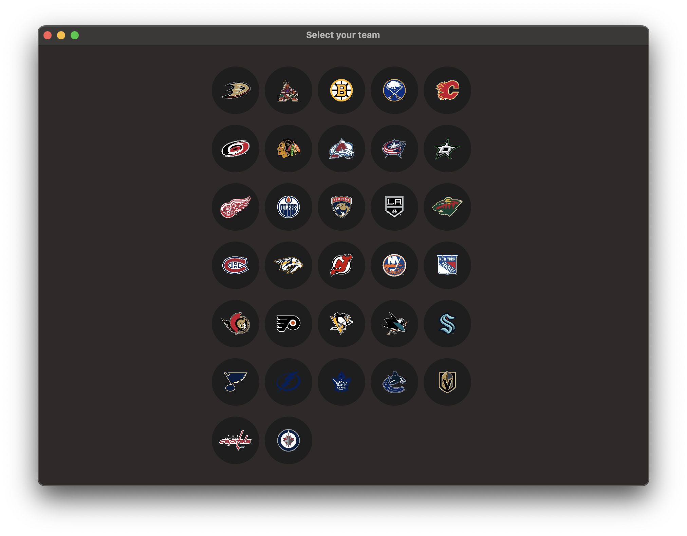
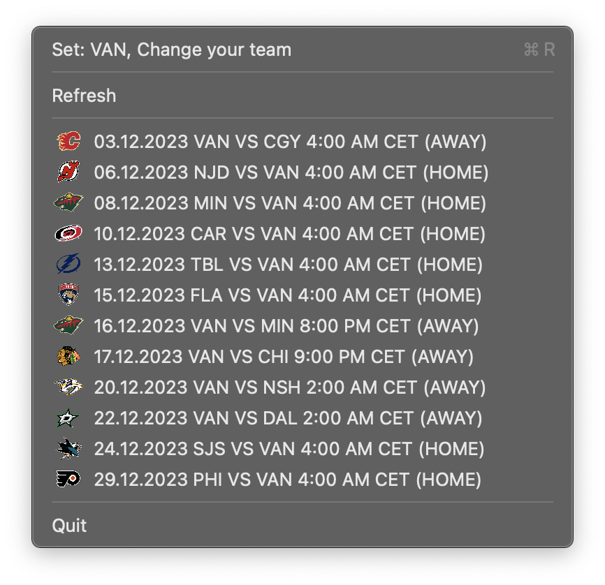

# NHL Schedule App

## Overview

The NHL Schedule App allows you to view the monthly schedule for any NHL team. Choose your favorite team, and the app will display their schedule for the selected month. Additionally, you can refresh the schedule to get the latest updates.

## Features

- Select your favorite NHL team.
- View the monthly schedule for the chosen team.
- Refresh the schedule to get the latest updates.

## How to Use

1. Download the NHL Schedule App repository.
2. Launch the app.
3. Select your favorite team from the team list.
4. The app will display the monthly schedule for the chosen team.
5. Use the refresh button to get the latest schedule updates.

## Requirements

- **macOS:** 13.0 or later

## Installation

1. Clone the repository to your local machine.
2. Open the project in Xcode.
3. Build and run the app on your preferred device or simulator.

## Contributing

Contributions are welcome! Please feel free to open an issue or submit a pull request.

## License

This project is licensed under the [MIT License](LICENSE).

## Acknowledgments

Special thanks to the NHL for providing the schedule data.

